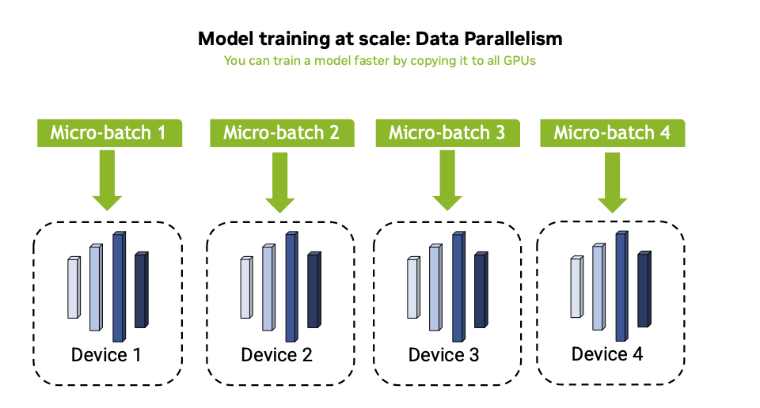
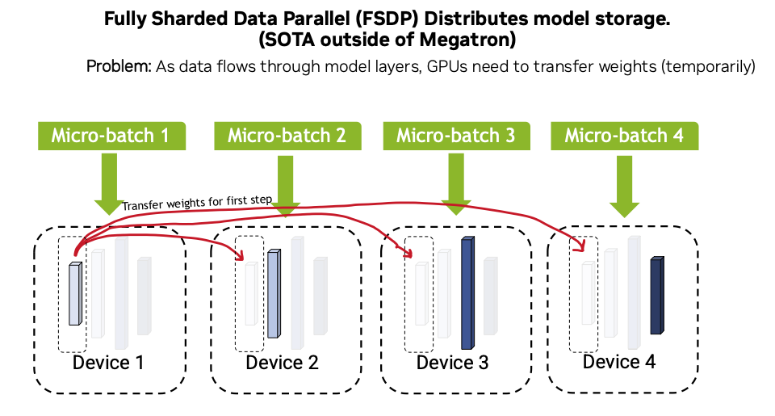
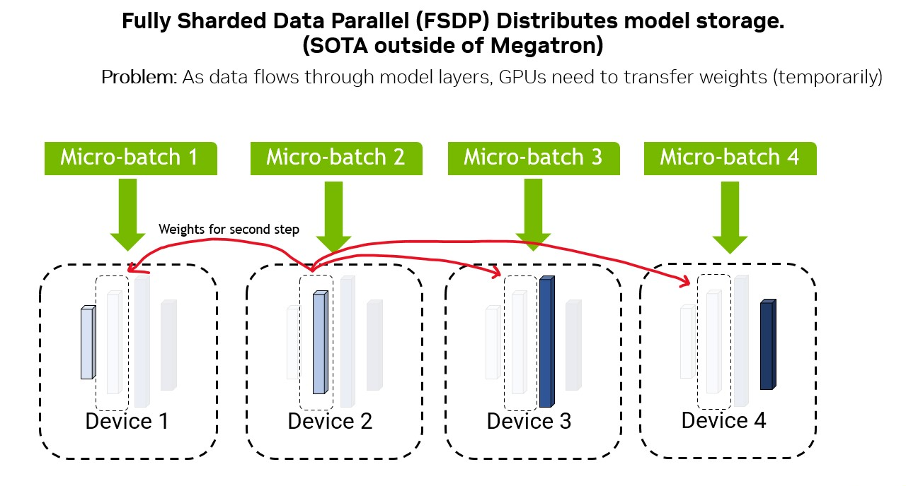
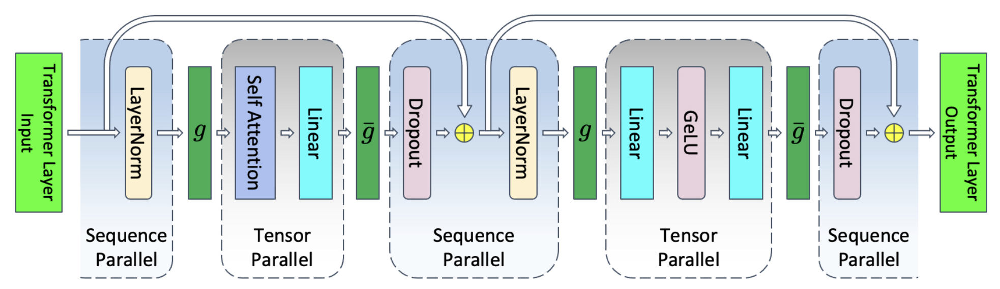
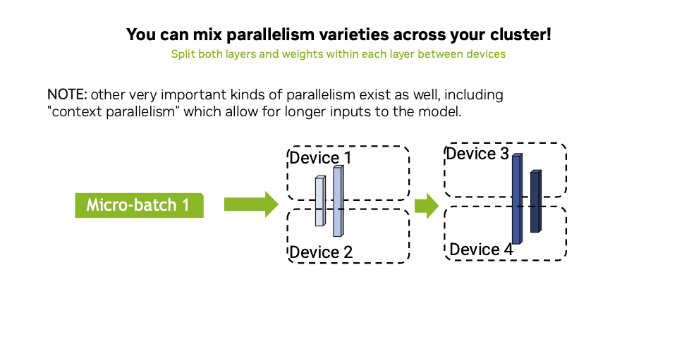
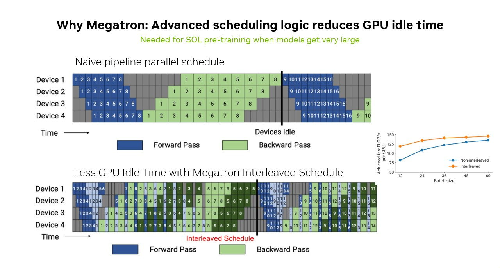

# NeMo2

## Checkpointing

In NeMo, there are two distinct mechanisms for continuing training from a checkpoint: resuming from a training
directory and restoring from a checkpoint.

> **Note**: If both `--result-dir` and `--ckpt-dir` are provided, checkpoints in `--result-dir` take precedence.
> The `--ckpt-dir` is only used if `--result-dir` contains no checkpoints.

**1. Resuming Training from a Directory**

When a training job runs, NeMo saves checkpoints in a designated results directory specified with the `--result-dir`
flag. If the same job is restarted and a checkpoint exists in that directory, the most recent checkpoint is
automatically loaded and training continues from the exact step and optimizer state stored there.

If no checkpoint is found in the results directory:

- No checkpoint directory specified → training starts from scratch.
- Checkpoint dir is specified by `--ckpt-dir` → NeMo attempts to restore from that checkpoint (see "Restoring from a
  Checkpoint" below).

**2. Restoring from a Checkpoint**

To start a new training run initialized from a checkpoint in a different directory, the restore configuration can be
set to point to that checkpoint via the `--ckpt-dir` flag. NeMo will begin training from that checkpoint’s weights and
optimizer state. After the initial restoration, subsequent runs of the same job follow the standard resuming flow -
loading from the results directory — without repeating the restore step.

```
               +-------------------------+
               | Start Training Job      |
               +-----------+-------------+
                         |
     +-------------------+-------------------+
     |                                       |
Results dir has                         Results dir empty
checkpoint → Resume                           |
                                             v
                                   +----------------------------+
                                   | Checkpoint dir specified?  |
                                   +-------------+--------------+
                                             |
                              +----------------+----------------+
                              |                                 |
                         No → Start from scratch        Yes → Restore
                                                       from checkpoint
                                                                 ↓
                                                            Resume flow
```

## Parallelism

NeMo2 represents tools and utilities to extend the capabilities of `pytorch-lightning` to support training and inference
with megatron models. While pytorch-lightning supports parallel abstractions sufficient for LLMs that fit on single GPUs
(distributed data parallel, aka DDP) and even somewhat larger architectures that need to be sharded across small
clusters of GPUs (Fully Sharded Data Parallel, aka FSDP), when you get to very large architectures and want the most
efficient pretraining and inference possible, megatron-supported parallelism is a great option.

So in other words, NeMo2 adds the Megatron strategy in addition to the standard DDP and FSDP strategies.

Many downstream constraints and conventions are driven by the underlying constraints of megatron.

### Deeper Background on Megatron

#### Other Options for Parallelizing Smaller Models

Megatron is a system for supporting advanced varieties of model parallelism. While vanilla models can be executed
in parallel with systems, such as distributed data parallel (DDP), or moderately large models can be trained with Meta's
Fully Sharded Data Parallel (FSDP/FSDP2), when you work with larger models and want to train them with maximal
efficiency, it is ideal to use some variant of megatron.

#### DDP Background

DDP is the best option **when you can fit the entire model on every GPU** in your cluster. With DDP, you can
parallelize your `global batch` across multiple GPUs by splitting it into smaller `mini-batches`, one for each GPU.
Each GPU computes the forward and backward pass independently for its subset of data, allowing for maximal utilization.
Synchronization of gradients occurs after the backward pass is complete for each batch, followed by a weight update
that ensures all GPUs have synchronized parameters for the next iteration. Here is an example of how this might appear
on your cluster with a small model:



#### FSDP Background

FSDP extends DDP by sharding (splitting) model weights across GPUs in your cluster to optimize memory usage.
While data is still split across GPUs in the same way as DDP, FSDP strategically synchronizes and broadcasts
the necessary shards of model weights to all GPUs just-in-time for computation during the forward pass.

For example, when a layer is needed for computation, the owning GPU sends that shard of weights to the other GPUs,
which then perform the forward computation on that layer. After the computation is complete, FSDP frees the memory for
that layer on all GPUs except the one that owns the shard. This process continues iteratively for each layer until the
entire model has been executed on the data.

**Note:** This process parallelizes the storage in a way that enables too large models to be executed (assuming a single
layer is not too large to fit on a GPU). Megatron (next) co-locates both storage and compute.

The following two figures show two steps through the forward pass of a model that has been sharded with FSDP.



#### Model Parallelism

Model parallelism is the catch-all term for the variety of different parallelism strategies
that could be applied to parallelizing your model across a cluster. Below we explain several varieties of model
parallelism that are implemented in megatron. As mentioned in the previous section, one key advantage to the
megatron-specific parallelism types described next are that they co-locate storage and compute of the layers. Inefficiencies
caused by naive scheduler implementations are also addressed (discussed in the section on schedulers).

##### Pipeline Parallelism

Pipeline parallelism is similar to FSDP, but the model blocks that are sharded are also computed in parallel on the
nodes that own the model weight in question. You can think of this as a larger simulated GPU that happens to be spread
across several child GPUs. Examples of this include `parallel_state.is_pipeline_last_stage()`, which is commonly
used to tell if a particular node is on last pipeline stage, where you compute the final head outputs or loss.


Similarly, there are convenience
environmental lookups for the first pipeline stage (where you compute the embedding for example)
`parallel_state.is_pipeline_first_stage()`.

##### Tensor Parallelism

Tensor parallelism represents splitting single layers across GPUs. This can also solve the problem where some individual
layers could in theory be too large to fit on a single GPU, where FSDP would not be possible. This would still work
since individual layer weights (and computations) are distributed. Examples of this in megatron include `RowParallelLinear` and
`ColumnParallelLinear` layers.


##### Sequence Parallelism

In megatron, "sequence parallelism" refers to the parallelization of the dropout, and layernorm blocks of a transformer.
The idea is roughly as follows. First, remember that in a typical transformer architecture, the `embedding_dimension` is
the only dimension that `LayerNorm` is applied over. Similarly, Dropout (outside of the attention block) is an operation
that is applied on the last embedding dimension. These two layers are independent over the sequence dimension, so they
can be processed in blocks on separate GPUs. As can be seen in the following figure, the initial `LayerNorm` in a
multi-headed transformer block is executed in parallel. Next the results are gathered for the self attention and linear
layers (which are typically set up for tensor parallelism). Next the result from those layers is scattered back to
sequence parallel nodes which execute dropout, do a residual connection from the previous sequence parallel output, and
a layernorm. Next those results are again gathered for the final FFN and activation layers prior to a final scattering
across sequence parallel GPUs for the output of that transformer block.


As a user, if you know that your transformer is executed in parallel and you have custom losses or downstream layers,
you need to make sure that the appropriate gather operations are occurring for your loss computation etc.

##### Context Parallelism

[Context parallelism](https://docs.nvidia.com/megatron-core/developer-guide/latest/api-guide/context_parallel.html)
extends sequence parallelism by also parallelizing the attention mechanism itself, similar to
[Ring Attention](https://arxiv.org/abs/2310.01889). In general, if you are using a transformer, context parallelism is
going to perform better than sequence parallelism for very long input sequences. That said, due to the necessity of
all-gather and reduce scatter operations throughout the architecture, the general advice that you should avoid these
kinds of parallelism if a micro-batch fits on a single device still holds. Splitting across elements in a global batch
represent the fewest necessary communications between GPUs on your cluster, so standard DDP should run the fastest if
you can get your training loop for a micro batch to fit on one GPU.

##### Mixing Parallelism Strategies

You can mix different kinds of parallelism together to achieve a better result. In general, experimentation
should be done to identify the optimal mix of parallelism. See this
[YouTube tutorial from Jared Casper](https://youtu.be/gHaNUcS1_O4) for more background on megatron parallelism
strategies.

The figure below demonstrates how mixing strategies results in larger "virtual GPUs", which similarly means you have
fewer distinct micro-batches in flight across your cluster. Note that the number of virtual GPUs is multiplicative
so if you have `TP=2` and `PP=2`, then you are creating a larger virtual GPU out of `2*2=4` GPUs, so your cluster size
needs to be a multiple of 4 in this case.


##### Scheduling Model Parallelism

You can improve on naive schedules by splitting up micro-batches into smaller pieces, executing many stages of the
model on single GPUs, and starting computing the backwards pass of one micro-batch while another is going through forward.
These optimizations allow for better cluster GPU utilization to be achieved. For example, the following figure shows
how more advanced splitting techniques in megatron (for example, the interleaved scheduler) offer better utilization when model
parallelism is used. As best possible, we don't recommend using model parallelism (DDP).

