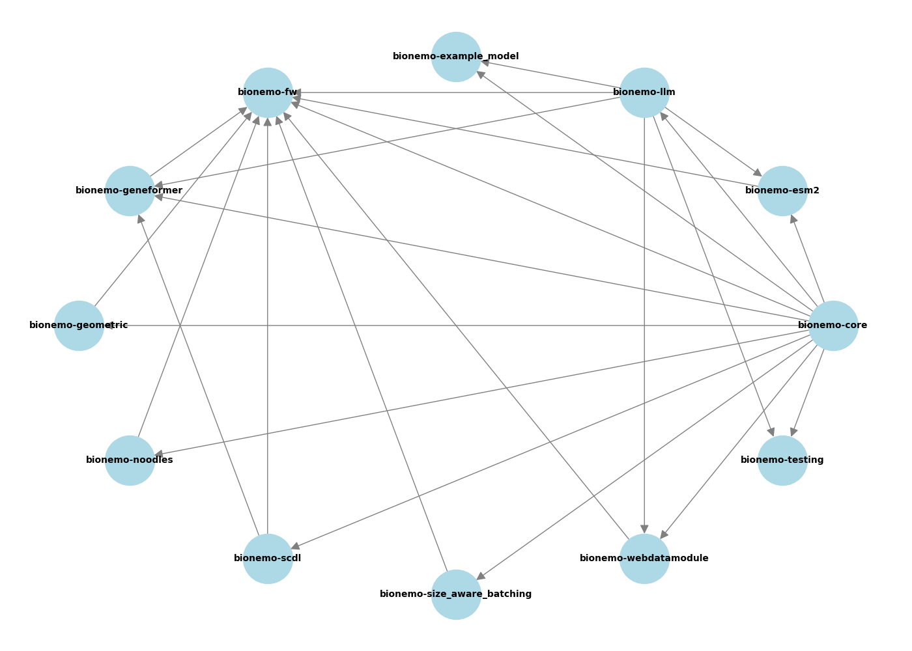
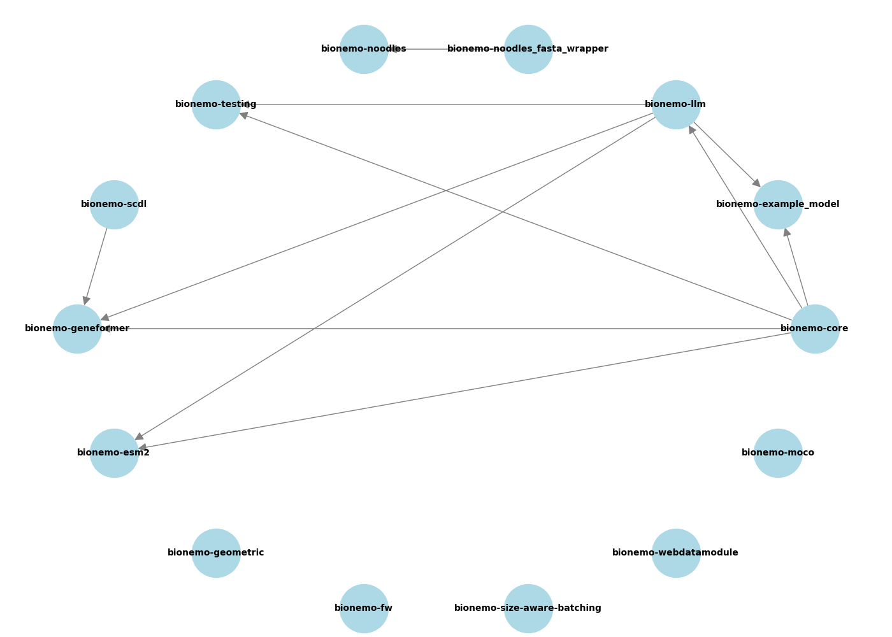

## Sub-Package Dependency Graph

The script in `sub-packages/bionemo/fw/src/dependency_graph.py` generates a dependency graph for the BioNeMo sub-packages and verifies that the pyproject.toml and tach.toml files align and capture the dependencies needed for imports in the python files. Additionally, it checks dependencies between BioNeMo sub-packages and creates visual representations of the dependencies in pyproject.toml files, in tach.toml, and in the source files.

These are visualizations of the dependency graph from the pyproject.toml files:

Similarly from the tach.toml file:

And these are the dependencies from the file imports:

